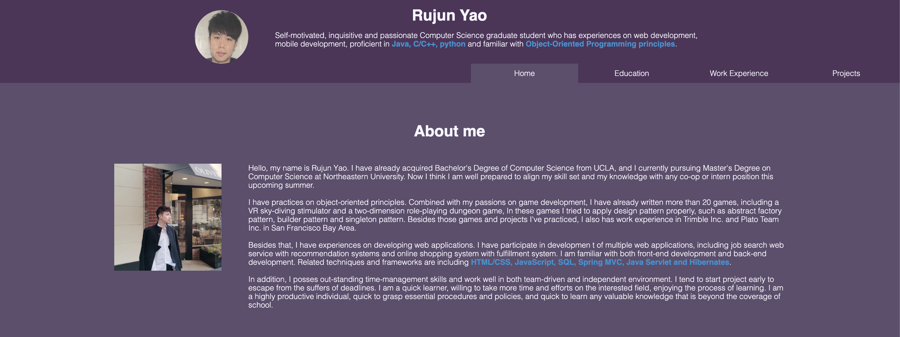

<h1 style="color: #2892d7">Rujun Yao's Personal Website</h1>
<h3>Author</h3>

Rujun Yao

<h3>Description</h3>

This page is fully developed by Rujun Yao and it contains personal content of the author. The author preserves any 
rights for the content of the website. The page is a assignment of <i>CS 5610 Web Development</i> from Northeastern
University and the instructor of the course also preserves any rights for the content of the website.   The page is 
developed in order to practice writing pages with HTML/CSS and minor JavaScript. The pages will be graded based on 
specific criteria.   <a href="https://johnguerra.co/classes/webDevelopment_fall_2020/">Course Link </a>
 <a href="http://rujunyao.com/">Website Link</a>
 <a href="https://youtu.be/BbIGwdDf9Ag">Demo video Link</a>

<h3>Screen shot</h3>

<h3>Build instruction</h3>

This page does not contains any libraries except es-lint. In order to get the library, simply clone the code
and run npm --install. 

<h3>License</h3>

This page is MIT licensed. 

